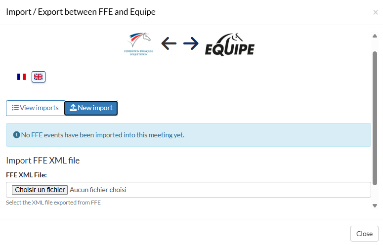
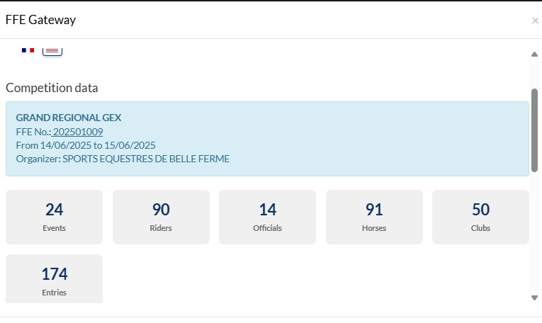
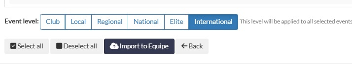
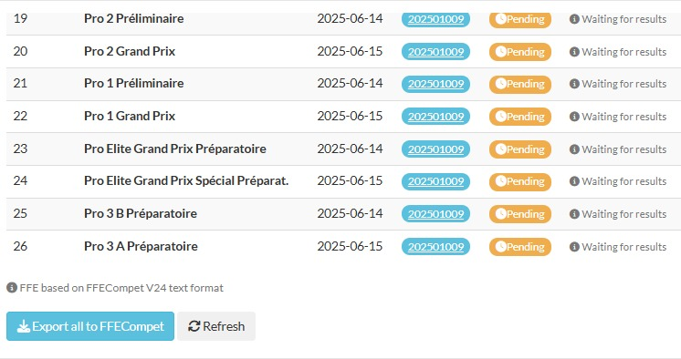

# FFE ↔︎ Equipe Import/Export Extension

A PHP extension that lets you **import competitions from an FFE XML file into Equipe** and **export results back to FFE formats** (FFECompet).
It provides a self‑contained web UI that can be embedded in an iframe inside Equipe and an AJAX API for automation.





---

## Table of Contents

- [Overview](#overview)
- [Key Features](#key-features)
- [Architecture & Files](#architecture--files)
- [Requirements](#requirements)
- [Installation](#installation)
- [Configuration](#configuration)
  - [.env.php](#envphp)
  - [Sessions & Cookies (Iframe-safe)](#sessions--cookies-iframe-safe)
  - [CORS](#cors)
- [Authentication & Entry Points](#authentication--entry-points)
- [Frontend UI Flow](#frontend-ui-flow)
- [AJAX Actions (API)](#ajax-actions-api)
- [Export Formats](#export-formats)
  - [FFECompet (V24)](#ffecompet-v24)
- [Translations](#translations)
- [Logging & Debugging](#logging--debugging)
- [Troubleshooting](#troubleshooting)
- [Security Notes](#security-notes)
- [License](#license)

---

## Overview

This extension exposes a single entry point, `index.php`, that can:

- Parse an **FFE XML** file (official FFE export) and stage its data for import into **Equipe**.
- Push the parsed data to **Equipe** using its REST endpoints (via `EquipeApiSender`).
- Export **results** from Equipe into **FFECompet (V24)** (and **SIF** text formats on todo).
Export work only on classes created with XML file so far
- Provide a **language‑switchable UI** (French/English) suitable for embedding in an iframe.

The extension communicates with Equipe using an **API key** and **meeting URL**, provided either via **JWT** (GET `?token=...`) or plain **POST** JSON payloads.

---

## Key Features

- ✅ Parse FFE XML and display competitions, stats (riders, horses, clubs, officials), and details
- ✅ Select competitions to import and **force a level** (Club/Local/Regional/National/Elite/International)
- ✅ Send data to Equipe **in the correct order** (people, clubs, horses, starts, competitions, etc.)
- ✅ Export **FFECompet V24** (single class or global batch across disciplines/meetings)
- ✅ Export **SIF** (single class)
- ✅ Detect classes with **available results** before export
- ✅ **Custom fields support** → generate FFE line **21** (engagement terrain) and **22** (invitation organisateur)
- ✅ **Officials/Jury export** → FFE line **20** (PDTJ/ASSJ) with judge license lookup
- ✅ **Two authentication flows**: JWT (GET) or plain POST
- ✅ **IFrame‑ready** (SameSite=None, Secure cookies) and **CORS‑controlled**

---

## Architecture & Files

```
/ (web root or subfolder)
├── index.php                    # Main entry (UI + API)
├── vendor/                      # Composer deps (firebase/php-jwt, …)
├── languages/
│   └── config.php               # Language detection + i18n loader
├── css/
│   └── custom.css               # UI tweaks
├── images/ (optional)           # ffe-logo.jpg, equipe.jpg
├── logs/
│   └── ffe_extension_YYYY-MM-DD.log
├── FFEParser.php                # (if present) legacy parsing helpers
├── FFEExportFormats.php         # Result formatting helpers
├── FFESIFExporter.php           # SIF exporter
├── FFEDataHelper.php            # Shared utilities
├── EquipeApiSender.php          # Equipe API client (send/import/results)
└── .env.php                     # Local configuration (optional)
```

**Namespaces & classes used in `index.php`:**

- `Firebase\JWT\JWT`, `Firebase\JWT\Key` (JWT decode)
- `FFE\Extension\FFEXmlParser` (parsing FFE XML into Equipe‑ready structure)
- `FFE\Extension\FFEResultFormatter` (pretty/flat text exports)
- `FFE\Extension\EquipeApiSender` (API calls to Equipe endpoints)
- `FFE\Extension\Export\SIFExporter` / `FFECompetExporter` (helper naming used by the code)

---

## Requirements

- **PHP 8.1+** (recommended 8.2/8.3)
- Extensions: `curl`, `json`, `dom`, `mbstring`, `openssl`
- Web server with **HTTPS** enabled if embedded in an iframe (due to `SameSite=None` cookies)
- **Composer** to install dependencies

---

## Installation

1. **Clone / copy** the code into your web root (or a subdirectory).
2. Install dependencies:
   ```bash
   composer install
   ```
3. (Optional) Create `logs/` with write permissions for your web user.
4. (Optional) Create `.env.php` (see next section).

---

## Configuration

### `.env.php`

Create a PHP array that returns your environment settings. Example:

```php
<?php
return [
  // Enables verbose logging + cURL verbose
  'DEBUG' => '1',

  // Shared secret used to decode GET ?token=... (HS256)
  'EQUIPE_SECRET' => 'change-me-super-secret',

  // You can put other keys here if you want to read them via $_ENV
];
```

This file is **included early** in `index.php`, and each key is copied into `$_ENV[...]`.

### Sessions & Cookies (Iframe-safe)

At bootstrap the app sets:

- `session.cookie_samesite = None`
- `session.cookie_secure = true`
- `session.cookie_httponly = true`

➡️ That means you **must** serve the extension over **HTTPS** whenever it’s embedded (otherwise cookies will be rejected by browsers).

### CORS

Default CORS is **restricted** to:

```
Access-Control-Allow-Origin: https://app.equipe.com
Access-Control-Allow-Credentials: true
Access-Control-Methods: GET, POST, OPTIONS
Access-Control-Headers: Content-Type, X-Api-Key, Authorization
```

If you embed from another domain, **adjust** the allowed origin in `index.php`.

---

## Authentication & Entry Points

**Two ways to provide credentials:**

1. **JWT (GET)**  
   Call `index.php?token=...` where the token is **HS256** signed with `$_ENV['EQUIPE_SECRET']`.  
   Payload fields used by the app:

```json
{
  "api_key": "YOUR_EQUIPE_API_KEY",
  "payload": {
    "meeting_url": "https://app.equipe.com/meetings/{id}",
    "target": "modal|browser|api",
    "style_url": "https://.../your-optional.css"
  }
}
```

- `target=api` → returns `{ success, api_key, meeting_url }` as JSON
- `target=modal|browser` → renders the interactive UI

2. **Plain POST (JSON or form-encoded)**  
   Send `api_key` and `meeting_url` with an `action` (see **AJAX Actions**).

---

## Frontend UI Flow

1. **Loading** → tests the Equipe API connection.
2. **Imports view** → lists Equipe competitions already **tagged as FFE** (`foreignid` like `FFE_*` or `^\d{9}_\d+$`), marks which ones **have results** and enables **export buttons**.
3. **Upload FFE XML** → parse file → show **stats** and **competition list**.
4. **Select competitions** and **choose level** (K/L/R/N/E/I), then **Import** → data is sent to Equipe in the right order.
5. **Export step** → optional check again & export results.

The UI supports **language switching** (FR/EN) via flag buttons (see **Translations**).

---

## AJAX Actions (API)

All actions are POSTed to `index.php` with `action=...`. Common parameters are `api_key` and `meeting_url`.

| Action                      | Purpose                                                                      | Required Params                                                                                                          | Returns (success)                              |
| --------------------------- | ---------------------------------------------------------------------------- | ------------------------------------------------------------------------------------------------------------------------ | ---------------------------------------------- |
| `test_connection`           | Quick health check against `competitions.json`                               | `api_key`, `meeting_url`                                                                                                 | `{ success, message, http_code }`              |
| `check_imported`            | List Equipe competitions flagged as FFE and mark those **with results**      | `api_key`, `meeting_url`                                                                                                 | `{ success, has_imports, competitions:[...] }` |
| `parse_ffe_xml`             | Parse uploaded **FFE XML** file                                              | `xml_file` (multipart)                                                                                                   | Parsed structure + stats stored in session     |
| `import_to_equipe`          | Import selected competitions (from parsed XML) into Equipe                   | `selected_competitions` (JSON array of `foreign_id`), `competition_level` (K/L/R/N/E/I), `api_key`, `meeting_url`        | `{ success, results }`                         |
| `export_sif`                | Export a **single** competition to **SIF**                                   | `competition_id`, `api_key`, `meeting_url`                                                                               | `{ filename, content(base64) }`                |
| `export_ffecompet`          | Export a **single** competition to **FFECompet V24**                         | `competition_id`, `api_key`, `meeting_url`                                                                               | `{ filename, content(base64) }`                |
| `export_ffecompet_global`   | Export **all** FFE competitions with results (grouped by discipline/meeting) | `api_key`, `meeting_url`                                                                                                 | `{ filename, content(base64) }` (first file)   |
| `update_competition_levels` | Update level of competitions in the in‑memory (session) dataset              | `competitions` (JSON array), `level`                                                                                     | `{ success }`                                  |
| `export_results`            | Flat text result export (pretty)                                             | `competition_id`, `competition_name`, `competition_clabb?`, `competition_date?`, `discipline?`, `api_key`, `meeting_url` | `{ filename, content(base64) }`                |
| `change_language`           | Toggle UI language                                                           | `lang` = `fr` or `en`                                                                                                    | `{ success, language }`                        |

> **Note:** All downloads are returned as **base64** content. The UI converts and triggers a browser download.

---

## Export Formats

### FFECompet (V24)

The generator writes fixed‑width **record lines** according to the FFECompet V24 spec:

- **00**: file header (`date`, tag `V024FFECompet ...`)
- **01**: contest header (`concours number`, `discipline code` via `mapDisciplineToFFECompetCode()` and **number of classes**)
- **02**: class declaration (`class number`, `number of results`)
- **20**: **jury** lines (president `PDTJ` + assessors `ASSJ`) with **license number** detection
- **21**, **22**: optional **custom fields** lines (engagement terrain / invitation organisateur) derived from each result’s `start_custom_fields`
- **05**: **Show Jumping** results (points/time/indice/presentation/place/prize)
- **06**: **Dressage** results (judge scores, averages, totals, place, prize, per‑judge % if provided)
- **99**: file footer (line count)

**Result status mapping** (`determineResultStatus()`):

- `FI` (Finished), `AB` (Retired), `EL` (Eliminated), `DI` (Disqualified), `NP` (Withdrawn/No‑show)
- Priority is given to result field `or` (Equipe results), with legacy fallbacks.

### SIF (TODO)

The SIF exporter (`FFESIFExporter`) builds an XML document with:

- Root `<sif version="1.0">`
- `<concours>` attributes (`id`, `nom`, `date`)
- `<epreuve>` attributes (`numero`, `discipline`, `niveau`), mapping via `mapDisciplineToSIF()` and `mapLevelToSIF()`
- `<participant>` entries with rider/horse/club and optional dressage details (per‑judge scores and `%`)

---

## Translations

- Language detection and loading via `languages/config.php`
- Current languages: **French (`fr`)** and **English (`en`)**
- Users can switch language via **flag buttons**, which invoke `action=change_language` and reload the page.

---

## Logging & Debugging

- Enable debug with `DEBUG=1` in `.env.php`
- Logs are written to: `logs/ffe_extension_YYYY-MM-DD.log`
- When enabled, cURL runs in **verbose** mode and responses are summarized (status code, preview)
- Additional **import pipeline** and **jury export** diagnostics are logged

---

## Troubleshooting

- **401 / 403** on test connection → invalid **X-Api-Key**
- **404** on `/competitions.json` → invalid **meeting_url** or not published/accessible
- **“Aucun fichier XML valide”** → ensure your form uses `enctype="multipart/form-data"` and PHP `upload_max_filesize` / `post_max_size` are sufficient
- **Downloads do nothing** → check browser pop‑up blockers and that base64 is being converted client‑side (UI does this automatically)
- **Iframe session lost** → must be served over **HTTPS** (SameSite=None requires Secure), and third‑party cookies must not be blocked for your embed scenario
- **Wrong jury licenses** → ensure your `people.json` includes officials (`rnr`/`id`) and that the IDs in competition fields (`ckb`, `hkb`, …) match your People dataset

---

## Security Notes

- Keep `EQUIPE_SECRET` **private**. It is used to validate **HS256** JWT tokens on `GET ?token=...`.
- The extension enables **cookies in iframes**. Host it **only over HTTPS**.
- CORS is restricted to `https://app.equipe.com` by default—**tighten/adjust** as needed for your deployment.
- Avoid logging **full API keys** in production (the code truncates them in debug logs).

---

### Credits

- Equipe (meetings API)
- FFE formats (FFECompet V24)
- JWT support via [`firebase/php-jwt`]
